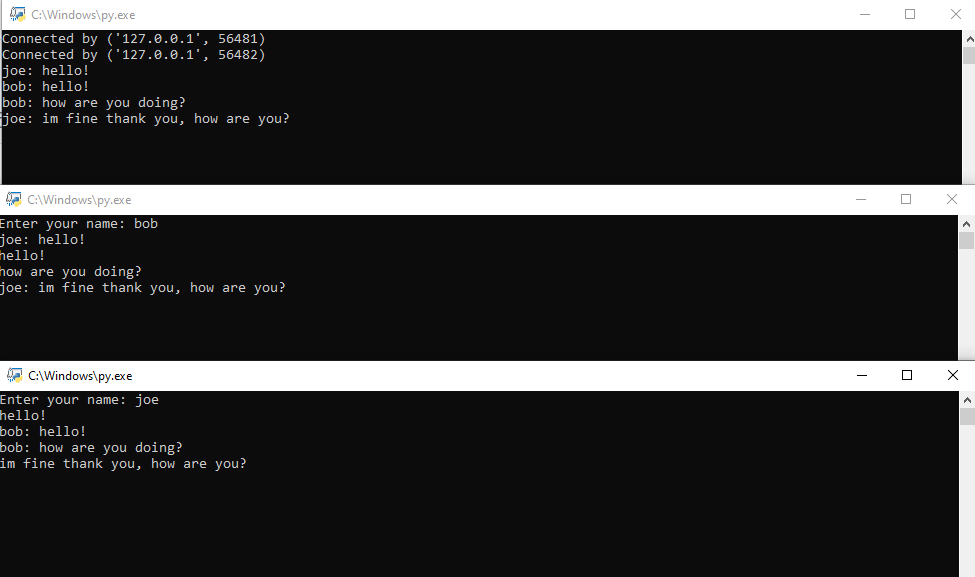

# Encrypted Group Chat
An encrypted group chat that features the Diffie-Hellman key exchange protocol, paired with 64-bit encryption.

## Diffie-Hellman Key Exchange Protocol
The Diffie-Hellman key exchange protocol is a fundamental cryptographic algorithm that enables two parties to securely exchange cryptographic keys over an untrusted communication channel.
It provides a method for secure key establishment without the need for a pre-existing shared secret.

## How It Works:

Initialization: Both parties agree on publicly available parameters: a large prime number (p) and a primitive root modulo p (g).

Key Generation: Each party generates its private key (a and b) without sharing it.

Public Key Calculation: Using the agreed-upon parameters and private keys, each party calculates its public key.

Party A: A = g^a mod p

Party B: B = g^b mod p

Key Exchange: Parties exchange their public keys.

Shared Secret Calculation: Both parties independently compute a shared secret using the received public key and their private key.

Party A: s = B^a mod p

Party B: s = A^b mod p

Result: Both parties now share a common secret key (s) without ever explicitly exchanging their private keys.

## Usage
First open the server, then the clients.

